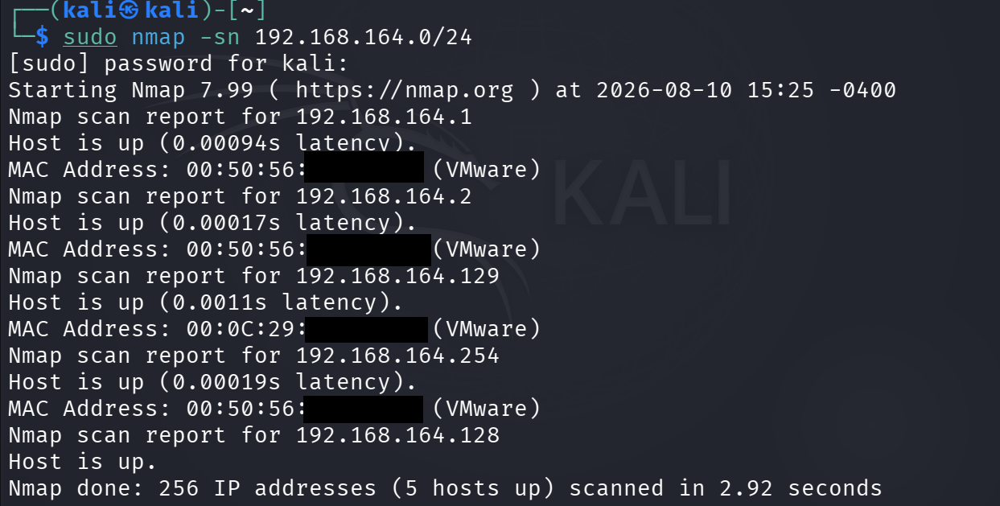

# Host Discovery

## Objective

To identify live and reachable hosts within the authorized local network using Nmap.

## Lab Environment

- Operating System: Kali Linux
- Target Environment: Local VMware laboratory network
- Tool: Nmap 7.99
- Network: 192.168.164.0/24

## Command Used

```bash
sudo nmap -sn 192.168.164.0/24
```
## Description

The -sn option performs host discovery without performing a traditional port scan. It was used to identify active and reachable hosts within the authorized local VMware network.

## Results

The scan identified 5 active hosts:

- 192.168.164.1
- 192.168.164.2
- 192.168.164.129
- 192.168.164.254
- 192.168.164.128

The Kali Linux system was identified at 192.168.164.128.

## Observation

Five reachable hosts were identified within the scanned subnet.

## Result

Host discovery was successfully completed using Nmap.

## Evidence

The following screenshot shows the Nmap host discovery scan and its results.



## Conclusion

The host discovery phase successfully identified active hosts within the authorized laboratory network. This information was used as the basis for subsequent port scanning and service enumeration.

## Authorization

This activity was performed against an authorized local laboratory environment for educational and cybersecurity training purposes.
