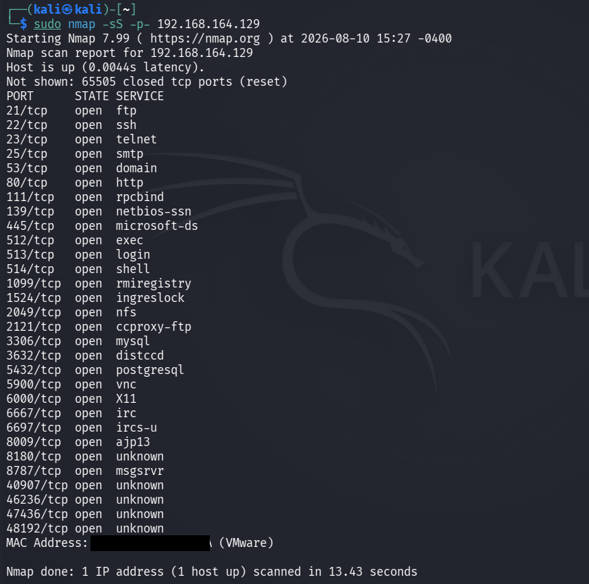

# Port Scanning

## Objective

To identify open TCP ports on the authorized Metasploitable laboratory target using Nmap.

## Lab Environment

- Operating System: Kali Linux
- Target Environment: Local VMware laboratory network
- Target System: Metasploitable 2
- Target IP Address: `192.168.164.129`
- Tool: Nmap 7.99
- Scan Type: TCP SYN Scan
- Port Range: 1-65535

## Introduction

Port scanning is an important phase of network reconnaissance. It is used to identify which network ports on a target system are open and potentially providing network services.

In this practical, Nmap was used to perform a TCP SYN scan against the authorized Metasploitable laboratory target.

The purpose of the scan was to identify the exposed TCP attack surface of the target before performing further service and version enumeration.

## Command Used

```bash
sudo nmap -sS -p- 192.168.164.129
```

## Command Explanation

### `sudo`

Runs Nmap with elevated privileges. Certain Nmap scanning techniques require privileged access to create and send raw network packets.

### `nmap`

Nmap is a network discovery and security auditing tool used to identify hosts, ports, services, and other network information.

### `-sS`

The `-sS` option performs a TCP SYN scan.

During a SYN scan, Nmap sends TCP SYN packets to the target ports and analyzes the responses to determine the port state.

A SYN scan is commonly used for TCP port discovery because it does not normally complete the full TCP connection.

### `-p-`

The `-p-` option instructs Nmap to scan all TCP ports from 1 through 65535.

This provides broader coverage than scanning only the most common ports.

### Target IP Address

`192.168.164.129` is the IP address of the authorized Metasploitable laboratory target.

## Methodology

The following steps were followed during the port scanning phase:

1. The target system was identified during the host discovery phase.
2. The target IP address `192.168.164.129` was selected for scanning.
3. A TCP SYN scan was performed using Nmap.
4. All TCP ports from 1 to 65535 were scanned.
5. Ports reported as open were recorded.
6. The discovered ports were used as the basis for subsequent service and version detection.

## Scan Results

The scan confirmed that the target host was reachable.

The target host was reported as **up**.

A total of **65535 TCP ports** were scanned.

Nmap reported **65505 closed TCP ports** that were not displayed individually.

The scan identified multiple open TCP ports.

## Discovered Open Ports

| Port | State | Service |
|---:|:---:|---|
| 21/tcp | open | ftp |
| 22/tcp | open | ssh |
| 23/tcp | open | telnet |
| 25/tcp | open | smtp |
| 53/tcp | open | domain |
| 80/tcp | open | http |
| 111/tcp | open | rpcbind |
| 139/tcp | open | netbios-ssn |
| 445/tcp | open | microsoft-ds |
| 512/tcp | open | exec |
| 513/tcp | open | login |
| 514/tcp | open | shell |
| 1099/tcp | open | rmiregistry |
| 1524/tcp | open | ingreslock |
| 2049/tcp | open | nfs |
| 2121/tcp | open | ccproxy-ftp |
| 3306/tcp | open | mysql |
| 3632/tcp | open | distccd |
| 5432/tcp | open | postgresql |
| 5900/tcp | open | vnc |
| 6000/tcp | open | X11 |
| 6667/tcp | open | irc |
| 6697/tcp | open | ircs-u |
| 8009/tcp | open | ajp13 |
| 8180/tcp | open | unknown |
| 8787/tcp | open | msgsrv |
| 40907/tcp | open | unknown |
| 46236/tcp | open | unknown |
| 47436/tcp | open | unknown |
| 48192/tcp | open | unknown |

## Observations

The target exposed a large number of TCP services across both standard and non-standard ports.

Several commonly known services were identified, including:

- FTP
- SSH
- Telnet
- SMTP
- DNS
- HTTP
- RPC
- SMB
- NFS
- MySQL
- PostgreSQL
- VNC
- IRC

The scan also identified services running on higher, non-standard ports.

The presence of multiple open ports indicates that the target has a relatively large network attack surface.

## Security Relevance

Open ports indicate network services that are reachable on the target system.

From a security assessment perspective, identifying open ports helps an assessor:

- Determine the exposed attack surface.
- Identify services requiring further investigation.
- Identify services running on unexpected ports.
- Prioritize service and version enumeration.
- Identify potentially unnecessary or insecure services.
- Plan subsequent security testing activities.

An open port does not automatically mean that the service is vulnerable. Further service identification, configuration review, and vulnerability validation are required.

## Relationship to Service Enumeration

The results from this port scan were used as the basis for the next phase of the assessment: service and version detection.

The discovered ports can subsequently be investigated using Nmap service detection to determine the software and version running behind each service.

## Result

The TCP SYN port scan successfully identified the exposed TCP ports of the authorized Metasploitable laboratory target.

The scan covered the complete TCP port range from 1 through 65535 and identified multiple open services.

## Evidence

The following screenshot shows the Nmap TCP SYN port scanning command and its results.



## Conclusion

The port scanning phase successfully identified the TCP attack surface of the authorized Metasploitable laboratory target.

The scan discovered multiple open ports providing different network services. These results provide the foundation for further enumeration, particularly service and version detection.

## Authorization

This activity was performed against an authorized local VMware laboratory environment containing a Metasploitable target for educational and cybersecurity training purposes.

Network scanning should only be performed against systems for which explicit authorization has been obtained.
