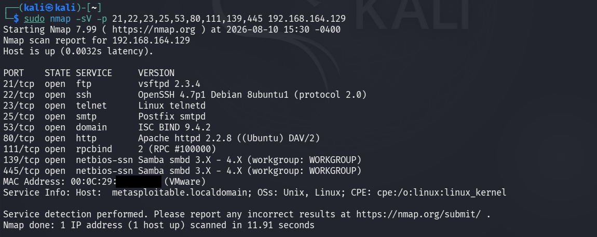
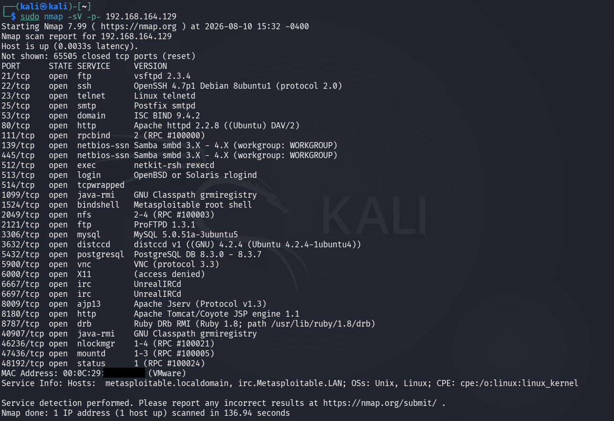

# Service & Version Detection

## Objective

To identify the services and software versions running on the open TCP ports of the authorized Metasploitable laboratory target using Nmap.

## Lab Environment

- Operating System: Kali Linux
- Target Environment: Local VMware laboratory network
- Target System: Metasploitable 2
- Target IP Address: `192.168.164.129`
- Tool: Nmap 7.99
- Scan Type: Service and Version Detection

## Introduction

After identifying open TCP ports during the port scanning phase, the next step in network enumeration is to determine which services are running on those ports.

Service and version detection helps identify the application or network service associated with an open port and attempts to determine the software version.

This information is useful for understanding the technology stack of a target and for prioritizing further security assessment.

## Command Used

```bash
sudo nmap -sV -p 21,22,23,25,53,80,111,139,445 192.168.164.129
```

## Command Explanation

### `sudo`

Runs Nmap with elevated privileges.

### `nmap`

Nmap is a network discovery and security auditing tool used to identify hosts, ports, services, and other network information.

### `-sV`

The `-sV` option enables service and version detection.

Nmap sends additional probes to open ports and analyzes the responses to determine the service and, where possible, the software version.

### `-p`

The `-p` option specifies which ports should be scanned.

In this practical, the following ports were selected:

`21, 22, 23, 25, 53, 80, 111, 139, 445`

These ports were selected from the open ports identified during the previous port scanning phase.

### Target IP Address

`192.168.164.129` is the IP address of the authorized Metasploitable laboratory target.

## Methodology

The following steps were followed during the service and version detection phase:

1. Open TCP ports were identified during the port scanning phase.
2. Selected open ports were provided to Nmap using the `-p` option.
3. Nmap service and version detection was enabled using `-sV`.
4. Nmap sent service-specific probes to the selected ports.
5. The responses were analyzed to identify the running services and their versions.
6. The detected information was documented for further security assessment.

## Scan Results

The target host was reported as up.

Nmap successfully identified services and versions on the selected ports.

The following service and version information was obtained:

| Port | Service | Version / Information |
|---:|---|---|
| 21/tcp | ftp | vsftpd 2.3.4 |
| 22/tcp | ssh | OpenSSH 4.7p1 Debian 8ubuntu1 (protocol 2.0) |
| 23/tcp | telnet | Linux telnetd |
| 25/tcp | smtp | Postfix smtpd |
| 53/tcp | domain | ISC BIND 9.4.2 |
| 80/tcp | http | Apache httpd 2.2.8 ((Ubuntu) DAV/2) |
| 111/tcp | rpcbind | RPC #100000 |
| 139/tcp | netbios-ssn | Samba smbd 3.X - 4.X |
| 445/tcp | netbios-ssn | Samba smbd 3.X - 4.X |

## Detailed Findings

### FTP — Port 21

Nmap identified:

`vsftpd 2.3.4`

The FTP service was exposed on TCP port 21.

This version information can be used for further authorized security research and validation.

### SSH — Port 22

Nmap identified:

`OpenSSH 4.7p1 Debian 8ubuntu1`

The SSH service was running on TCP port 22 using protocol version 2.0.

### Telnet — Port 23

Nmap identified:

`Linux telnetd`

Telnet was exposed on TCP port 23.

Telnet is an older remote-access protocol and should be carefully reviewed in modern environments because traditional Telnet communication does not provide the same protection as secure remote-access protocols.

### SMTP — Port 25

Nmap identified:

`Postfix smtpd`

The SMTP service was exposed on TCP port 25.

### DNS — Port 53

Nmap identified:

`ISC BIND 9.4.2`

The DNS service was exposed on TCP port 53.

### HTTP — Port 80

Nmap identified:

`Apache httpd 2.2.8 ((Ubuntu) DAV/2)`

The HTTP service was exposed on TCP port 80.

### RPCBind — Port 111

Nmap identified:

`RPC #100000`

The RPCBind service was exposed on TCP port 111.

### SMB / NetBIOS — Ports 139 and 445

Nmap identified Samba services on both TCP ports 139 and 445.

The detected information was:

`Samba smbd 3.X - 4.X`

These ports are commonly associated with SMB/NetBIOS-based file and network service functionality.

## Additional Service Detection

A broader service and version detection scan was also performed against the target to identify services running on additional open ports.

The broader scan identified services including:

- FTP
- SSH
- Telnet
- SMTP
- DNS
- HTTP
- RPCBind
- Samba
- rexec
- rlogin
- shell
- Java RMI
- Bind Shell
- NFS
- ProFTPD
- MySQL
- Distccd
- PostgreSQL
- VNC
- X11
- IRC
- Apache JServ
- Apache Tomcat
- Ruby DRb
- RPC-related services

Examples of detected software included:

| Port | Service | Detected Version / Information |
|---:|---|---|
| 512/tcp | exec | netkit-rsh rexecd |
| 513/tcp | login | OpenBSD or Solaris rlogind |
| 1099/tcp | java-rmi | GNU Classpath grmiregistry |
| 1524/tcp | bindshell | Metasploitable root shell |
| 2049/tcp | nfs | NFS / RPC |
| 2121/tcp | ftp | ProFTPD 1.3.1 |
| 3306/tcp | mysql | MySQL 5.0.51a-3ubuntu5 |
| 3632/tcp | distccd | distccd v1 |
| 5432/tcp | postgresql | PostgreSQL DB 8.3.0 - 8.3.7 |
| 5900/tcp | vnc | VNC protocol 3.3 |
| 6667/tcp | irc | UnrealIRCd |
| 6697/tcp | irc | UnrealIRCd |
| 8009/tcp | ajp13 | Apache JServ |
| 8180/tcp | http | Apache Tomcat/Coyote JSP engine 1.1 |
| 8787/tcp | drb | Ruby DRb RMI |
| 40907/tcp | java-rmi | GNU Classpath grmiregistry |
| 46236/tcp | nlockmgr | RPC service |
| 47436/tcp | mountd | RPC service |
| 48192/tcp | status | RPC service |

## Observations

Service and version detection provided significantly more information than the initial port scan.

The port scan only identified open ports and generic service names, while version detection provided additional information about the software running behind those services.

The target exposed a large and diverse collection of network services, including remote-access services, file-sharing services, databases, web services, RPC services, and application services.

## Security Relevance

Service and version information is valuable during a security assessment because it helps an assessor:

- Understand the target technology stack.
- Identify outdated or legacy software.
- Prioritize services for further assessment.
- Research applicable security advisories.
- Identify services that may require configuration review.
- Determine which enumeration techniques may be appropriate for each service.

A detected software version should not automatically be considered vulnerable. Vulnerability status should be verified using reliable security information and appropriate testing.

## Result

Service and version detection was successfully performed against the authorized Metasploitable laboratory target.

Nmap identified multiple services and provided version information for the selected ports. The broader scan also identified additional services and technologies running on the target.

The collected information provides a foundation for further enumeration and security assessment.

## Evidence

The following screenshots show the Nmap service and version detection scans and their results.





## Conclusion

The service and version detection phase successfully identified the technologies and software versions associated with multiple open ports on the target.

This information significantly improves the understanding of the target's network attack surface and provides useful input for subsequent security testing and vulnerability assessment.

## Authorization

This activity was performed against an authorized local VMware laboratory environment containing a Metasploitable target for educational and cybersecurity training purposes.

Network scanning and security testing should only be performed against systems for which explicit authorization has been obtained.
