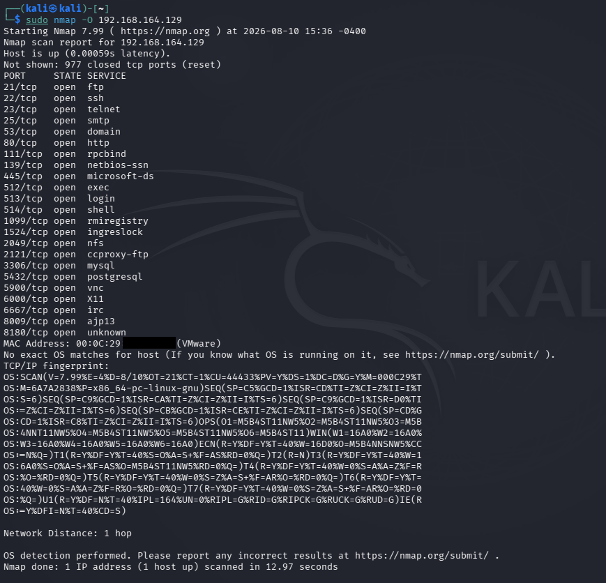
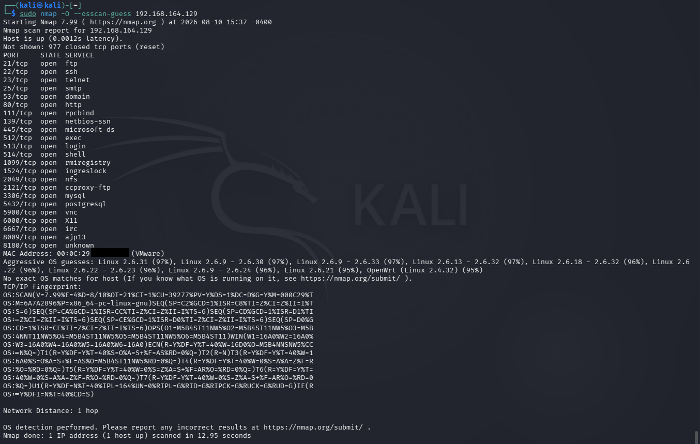

# OS Detection

## Objective

To identify and fingerprint the operating system of the authorized Metasploitable laboratory target using Nmap OS detection techniques.

## Lab Environment

- Operating System: Kali Linux
- Target Environment: Local VMware laboratory network
- Target System: Metasploitable 2
- Target IP Address: `192.168.164.129`
- Tool: Nmap 7.99
- Technique: TCP/IP OS Fingerprinting

## Introduction

Operating System detection is an important phase of network reconnaissance.

Nmap can analyze responses from the target system and compare the observed TCP/IP characteristics against its operating system fingerprint database.

The purpose of OS detection is to determine the probable operating system and kernel family running on the target system.

In this practical, Nmap OS detection was performed against the authorized Metasploitable laboratory target.

## Command 1 — OS Detection

```bash
sudo nmap -O 192.168.164.129
```

## Command Explanation

### `sudo`

Runs Nmap with elevated privileges.

OS detection generally requires privileged access because Nmap uses specialized network probes to analyze the target's TCP/IP behavior.

### `nmap`

Nmap is a network discovery and security auditing tool used to identify hosts, ports, services, and operating system information.

### `-O`

The `-O` option enables Nmap operating system detection.

Nmap sends a series of probes to the target and analyzes characteristics such as TCP/IP responses to compare them against known operating system fingerprints.

### Target IP Address

`192.168.164.129` is the IP address of the authorized Metasploitable laboratory target.

## Command 2 — OS Detection with Guessing

```bash
sudo nmap -O --osscan-guess 192.168.164.129
```

## Command Explanation

### `--osscan-guess`

The `--osscan-guess` option tells Nmap to provide more aggressive operating system guesses when the fingerprint does not exactly match a known operating system.

This can provide additional possible OS matches, but the results should be treated as estimates rather than confirmed identification.

## Methodology

The following steps were followed during the OS detection phase:

1. The target system was identified during the previous reconnaissance phases.
2. The target IP address `192.168.164.129` was selected.
3. Nmap OS detection was performed using the `-O` option.
4. Nmap analyzed the TCP/IP fingerprint of the target.
5. A second scan was performed using `--osscan-guess` to obtain additional possible matches.
6. The detected operating system information was recorded.
7. The results were compared with the known laboratory environment.

## Scan Results

The target host was reported as up.

Nmap was able to generate a TCP/IP fingerprint for the target.

The first OS detection scan did not identify an exact operating system match.

The output indicated several possible Linux kernel matches with high confidence.

The results included Linux kernel families such as:

- Linux 2.6.9
- Linux 2.6.13
- Linux 2.6.18
- Linux 2.6.22
- Linux 2.6.23
- Linux 2.6.24
- Linux 2.6.32

Nmap also reported a possible OpenWrt match with a high confidence value.

## OS Detection with `--osscan-guess`

The second scan provided additional OS fingerprint guesses.

Nmap reported several Linux kernel versions as possible matches, including:

- Linux 2.6.9 - 2.6.30
- Linux 2.6.9 - 2.6.33
- Linux 2.6.13 - 2.6.30
- Linux 2.6.18 - 2.6.32
- Linux 2.6.22
- Linux 2.6.22 - 2.6.23
- Linux 2.6.9 - 2.6.24
- Linux 2.6.21

The scan did not provide an exact operating system identification.

## Result Interpretation

The OS detection results strongly suggested that the target was running a Linux-based operating system.

However, Nmap did not provide an exact OS match.

This is important because OS fingerprinting is based on network behavior and is therefore affected by factors such as:

- Network configuration
- Firewall behavior
- Virtualization
- Packet filtering
- Kernel configuration
- Network distance
- Similarities between operating system fingerprints

Therefore, the detected OS information should be treated as a fingerprint-based assessment rather than absolute confirmation.

## Network Distance

Nmap reported:

`Network Distance: 1 hop`

This indicates that the target was one network hop away from the scanning system in the laboratory environment.

## Observations

The OS detection scan successfully generated a TCP/IP fingerprint for the target.

The fingerprint showed strong similarities with multiple Linux kernel versions.

The presence of several possible Linux matches indicates that the target's network behavior was consistent with a Linux-based operating system.

The `--osscan-guess` option provided additional possible matches but did not produce an exact identification.

## Security Relevance

Operating system identification can help security professionals:

- Understand the target environment.
- Identify probable operating system families.
- Prioritize appropriate enumeration techniques.
- Identify potentially outdated operating system versions.
- Select relevant security assessment methods.
- Correlate operating system information with detected services.

OS detection results should be validated using additional authorized information whenever possible.

## Relationship to Previous Phases

The OS detection phase builds upon the information collected during host discovery, port scanning, and service enumeration.

The previous phases established that:

1. The target host was reachable.
2. Multiple TCP ports were open.
3. Multiple network services were exposed.
4. Service and version information was available.

OS detection adds another layer of information by attempting to identify the underlying operating system.

## Result

Nmap successfully performed operating system detection against the authorized Metasploitable laboratory target.

The scan generated a TCP/IP fingerprint and identified several possible Linux kernel matches.

An exact operating system match was not obtained, so the results were documented as probable OS fingerprints rather than confirmed identification.

## Evidence

The following screenshots show the Nmap OS detection scans and their results.





## Conclusion

The OS detection phase successfully generated a TCP/IP fingerprint of the authorized Metasploitable laboratory target.

The results strongly indicated a Linux-based operating system, with several Linux kernel versions appearing as possible matches.

The additional `--osscan-guess` scan provided broader fingerprint-based possibilities but did not establish an exact operating system match.

## Authorization

This activity was performed against an authorized local VMware laboratory environment containing a Metasploitable target for educational and cybersecurity training purposes.

Operating system detection and network scanning should only be performed against systems for which explicit authorization has been obtained.
