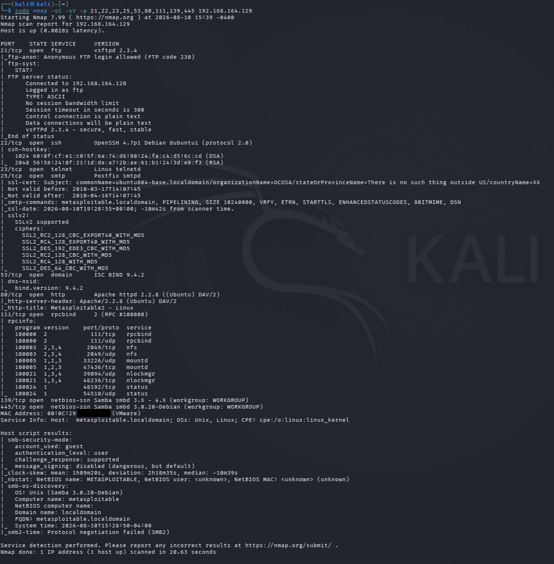

# NSE Script Scanning

## Objective

To perform automated network enumeration using Nmap Scripting Engine (NSE) default scripts against the authorized Metasploitable laboratory target.

## Lab Environment

- Operating System: Kali Linux
- Target Environment: Local VMware laboratory network
- Target System: Metasploitable 2
- Target IP Address: `192.168.164.129`
- Tool: Nmap 7.99
- Technique: Nmap Scripting Engine (NSE)
- Script Category: Default NSE Scripts

## Introduction

The Nmap Scripting Engine (NSE) extends Nmap's functionality by allowing scripts to perform additional network discovery and enumeration tasks.

NSE scripts can gather information that may not be visible through a basic port scan.

In this practical, Nmap's default NSE scripts were used together with service and version detection against selected open ports of the authorized Metasploitable laboratory target.

The objective was to collect additional information about the services exposed by the target.

## Command Used

```bash
sudo nmap -sC -sV -p 21,22,23,25,53,80,111,139,445 192.168.164.129
```

## Command Explanation

### `sudo`

Runs Nmap with elevated privileges.

### `nmap`

Nmap is a network discovery and security auditing tool.

### `-sC`

The `-sC` option enables Nmap's default NSE scripts.

These scripts perform additional enumeration against detected services.

The scripts can retrieve information such as service configuration details, protocol information, host information, and other publicly exposed data.

### `-sV`

The `-sV` option enables service and version detection.

It attempts to determine the software and version associated with the detected services.

### `-p`

The `-p` option specifies the ports to scan.

The following ports were selected based on the open ports identified during earlier reconnaissance:

`21, 22, 23, 25, 53, 80, 111, 139, 445`

### Target IP Address

`192.168.164.129` is the IP address of the authorized Metasploitable laboratory target.

## Methodology

The following steps were followed during the NSE script scanning phase:

1. Open TCP ports were identified during the port scanning phase.
2. Selected ports were provided to Nmap using the `-p` option.
3. Service and version detection was enabled using `-sV`.
4. Default NSE scripts were enabled using `-sC`.
5. Nmap executed the applicable default scripts against the selected services.
6. The returned information was analyzed and documented.
7. The results were used to understand the additional information exposed by the target services.

## Scan Results

The target host was reported as up.

Nmap successfully executed multiple default NSE scripts against the selected services.

The scan returned additional information for FTP, SSH, SMTP, DNS, HTTP, RPC, and SMB-related services.

## FTP Enumeration

The NSE output identified:

**Anonymous FTP login allowed**

The FTP server was also identified as:

`vsftpd 2.3.4`

The script output indicated that anonymous FTP access was available.

This is an important configuration finding because anonymous access can allow unauthenticated users to interact with an FTP service depending on the server configuration.

## SSH Enumeration

NSE scripts identified SSH host keys associated with the SSH service.

The output included:

- DSA host key
- RSA host key

The SSH service was previously identified as:

`OpenSSH 4.7p1 Debian 8ubuntu1`

The NSE results provided additional information about the SSH service beyond the basic port and version information.

## SMTP Enumeration

The NSE scan collected information from the SMTP service.

The output identified:

`Postfix smtpd`

The scan also returned SMTP service capabilities and configuration-related information.

The service advertised multiple SMTP extensions.

## SSL/TLS Information

The NSE output identified SSL/TLS-related information associated with the SMTP service.

The scan reported support for several older SSLv2 cipher configurations.

This demonstrates how NSE scripts can provide deeper protocol-level information beyond basic service identification.

## DNS Enumeration

The DNS service was identified as:

`ISC BIND 9.4.2`

The NSE output provided additional DNS-related service information.

## HTTP Enumeration

The HTTP service was identified as:

`Apache httpd 2.2.8 ((Ubuntu) DAV/2)`

The NSE output also identified the HTTP title:

`Metasploitable2 - Linux`

This provided additional information about the web service running on the target.

## RPC Enumeration

The NSE scan collected RPC information from the RPCBind service.

The output showed multiple RPC program entries and their associated ports.

This information can help an assessor understand which RPC-based services are exposed by the target.

## SMB Enumeration

The NSE scan provided additional information about the SMB services running on ports 139 and 445.

The output identified:

`Samba smbd 3.0.20-Debian`

The `smb-security-mode` script reported information including:

- Account used: guest
- Authentication level: user
- Challenge/response: supported
- Message signing: disabled

The SMB information also indicated that guest-level access information was exposed by the service.

## SMB OS Discovery

The NSE scan also returned operating system information through SMB enumeration.

The output identified:

- OS: Unix
- OS details: Samba 3.0.20-Debian
- Computer name: metasploitable
- NetBIOS domain name: localdomain
- FQDN: metasploitable.localdomain

This provided additional host information that was not available from the basic port scan alone.

## Observations

The NSE scan revealed significantly more information than a basic port scan.

The results demonstrated that default NSE scripts can automatically gather service-specific information such as:

- Anonymous FTP access
- SSH host keys
- SMTP capabilities
- SSL/TLS information
- HTTP title
- RPC program information
- SMB security configuration
- SMB operating system information
- Host and NetBIOS information

The scan therefore provided a deeper view of the target's exposed services.

## Security Relevance

NSE enumeration can help security professionals:

- Identify potentially insecure service configurations.
- Discover anonymous or guest access.
- Gather additional host information.
- Identify legacy protocols and configurations.
- Enumerate network services more efficiently.
- Prioritize services for further authorized security testing.

The presence of an NSE finding does not automatically mean that the target is vulnerable. Each finding should be validated and assessed in context.

## Key Findings

| Service | NSE Finding |
|---|---|
| FTP | Anonymous FTP login allowed |
| SSH | SSH host keys identified |
| SMTP | Service capabilities and configuration information identified |
| SSL/TLS | Older SSLv2 configurations detected |
| DNS | BIND service information identified |
| HTTP | Web server and page title identified |
| RPC | RPC program information identified |
| SMB | Samba service and security information identified |
| SMB | Guest account information exposed |
| SMB | Message signing reported as disabled |
| SMB | Host and operating system information identified |

## Result

Nmap successfully executed the default NSE scripts against the selected services of the authorized Metasploitable laboratory target.

The scan collected additional information about FTP, SSH, SMTP, DNS, HTTP, RPC, and SMB services.

The results demonstrated how NSE can extend basic network scanning by providing service-specific enumeration and configuration information.

## Evidence

The following screenshot shows the Nmap NSE script scanning command and its results.



## Conclusion

The NSE script scanning phase successfully performed additional automated enumeration against the authorized Metasploitable laboratory target.

The default NSE scripts identified several important service-level details, including anonymous FTP access, SSH host keys, SMTP information, HTTP information, RPC details, and SMB security and host information.

This phase provided deeper enumeration results that can be used to guide subsequent authorized security assessment activities.

## Authorization

This activity was performed against an authorized local VMware laboratory environment containing a Metasploitable target for educational and cybersecurity training purposes.

NSE scanning and network enumeration should only be performed against systems for which explicit authorization has been obtained.
