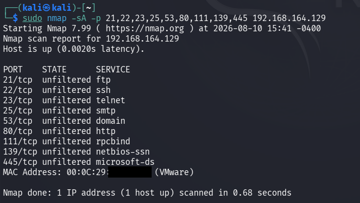

# Firewall Detection

## Objective

To analyze the filtering behavior of the authorized Metasploitable laboratory target using an Nmap TCP ACK scan.

## Lab Environment

- Operating System: Kali Linux
- Target Environment: Local VMware laboratory network
- Target System: Metasploitable 2
- Target IP Address: `192.168.164.129`
- Tool: Nmap 7.99
- Technique: TCP ACK Scan
- Purpose: Firewall and packet-filtering behavior analysis

## Introduction

Firewall detection is an important part of network reconnaissance.

A firewall or packet-filtering device can affect how network probes reach a target and how responses are returned.

Nmap provides several scanning techniques that can help analyze packet-filtering behavior.

In this practical, a TCP ACK scan was performed against selected ports of the authorized Metasploitable laboratory target.

The objective was to observe whether the tested ports appeared to be filtered or unfiltered.

## Command Used

```bash
sudo nmap -sA -p 21,22,23,25,53,80,111,139,445 192.168.164.129
```

## Command Explanation

### `sudo`

Runs Nmap with elevated privileges.

### `nmap`

Nmap is a network discovery and security auditing tool used to analyze hosts, ports, services, and network filtering behavior.

### `-sA`

The `-sA` option performs a TCP ACK scan.

An ACK scan is primarily used to determine whether ports are being filtered by a firewall or packet-filtering mechanism.

Unlike a SYN scan, an ACK scan does not directly determine whether a port is open or closed.

Instead, Nmap generally classifies the tested ports as:

- `filtered`
- `unfiltered`

### `-p`

The `-p` option specifies the ports to be scanned.

The following ports were selected based on services identified during earlier reconnaissance:

`21,22,23,25,53,80,111,139,445`

### Target IP Address

`192.168.164.129` is the IP address of the authorized Metasploitable laboratory target.

## Methodology

The following steps were followed during the firewall detection phase:

1. The target IP address was identified during the previous reconnaissance phases.
2. Selected TCP ports were chosen from the previously discovered open services.
3. A TCP ACK scan was performed using the `-sA` option.
4. Nmap sent TCP ACK probes to the selected ports.
5. The responses were analyzed to determine whether the ports appeared filtered or unfiltered.
6. The results were documented for further analysis.

## Scan Results

The target host was reported as up.

Nmap returned the following result for the tested ports:

**All tested ports were reported as `unfiltered`.**

The scan produced the following port classifications:

| Port | State | Service |
|---:|:---:|---|
| 21/tcp | unfiltered | ftp |
| 22/tcp | unfiltered | ssh |
| 23/tcp | unfiltered | telnet |
| 25/tcp | unfiltered | smtp |
| 53/tcp | unfiltered | domain |
| 80/tcp | unfiltered | http |
| 111/tcp | unfiltered | rpcbind |
| 139/tcp | unfiltered | netbios-ssn |
| 445/tcp | unfiltered | microsoft-ds |

## Understanding `unfiltered`

In an ACK scan, an `unfiltered` result indicates that Nmap received a response indicating that the probe was not blocked by a filtering mechanism on the tested path.

It does **not** mean that the port is necessarily open.

The actual open or closed state of a port is normally determined using other scan types, such as the TCP SYN scan performed earlier in this assessment.

Therefore, the `unfiltered` result should be interpreted as information about packet filtering rather than direct confirmation of port availability.

## Observations

The TCP ACK scan reported all tested ports as `unfiltered`.

This indicates that the ACK probes were able to receive responses and that the tested ports were not classified as filtered by Nmap.

The earlier TCP SYN scan had already established that these ports were open on the target.

The combination of both scans provides more useful information:

- SYN scan: identifies whether TCP ports are open.
- ACK scan: helps analyze whether those ports are being filtered.

## Firewall Interpretation

The scan results did not show the tested ports as `filtered`.

Therefore, within the scope of this specific ACK scan, Nmap did not observe packet filtering that caused the tested ports to be classified as filtered.

However, this scan alone cannot prove that the target has no firewall.

Firewall behavior can vary depending on:

- Source IP address
- Network location
- Firewall rules
- Protocol
- Port
- Packet type
- Stateful inspection
- Network topology

Therefore, the result should be reported as:

**The tested ports were classified as unfiltered by the TCP ACK scan.**

It should not be reported as definitive proof that no firewall exists.

## Security Relevance

Firewall detection can help security professionals:

- Understand network filtering behavior.
- Identify potentially filtered ports.
- Determine whether probes are being blocked.
- Understand how network security controls affect reconnaissance.
- Compare filtering behavior across different scan types.

Understanding filtering behavior can help an assessor plan appropriate authorized enumeration techniques.

## Comparison with Port Scanning

The earlier TCP SYN scan identified multiple open ports on the target.

The ACK scan provided additional information about packet filtering.

| Scan Type | Purpose | Result in This Lab |
|---|---|---|
| TCP SYN Scan | Identify open TCP ports | Multiple ports reported open |
| TCP ACK Scan | Analyze filtering behavior | Tested ports reported unfiltered |

This demonstrates why different Nmap scan types can provide different types of information about the same target.

## Result

The TCP ACK scan successfully analyzed the filtering behavior of the selected ports on the authorized Metasploitable laboratory target.

All tested ports were classified as `unfiltered`.

The results indicate that Nmap did not observe filtering that caused the tested ports to be classified as filtered during this scan.

The result does not independently prove the absence of a firewall.

## Evidence

The following screenshot shows the Nmap TCP ACK scan and its results.



## Conclusion

The firewall detection phase successfully performed a TCP ACK scan against the authorized Metasploitable laboratory target.

All selected ports were reported as `unfiltered`.

The results indicate that the tested ACK probes were not classified as filtered by Nmap. Further testing and network configuration analysis would be required to make a definitive determination about firewall deployment.

## Authorization

This activity was performed against an authorized local VMware laboratory environment containing a Metasploitable target for educational and cybersecurity training purposes.

Firewall detection and network scanning should only be performed against systems for which explicit authorization has been obtained.
