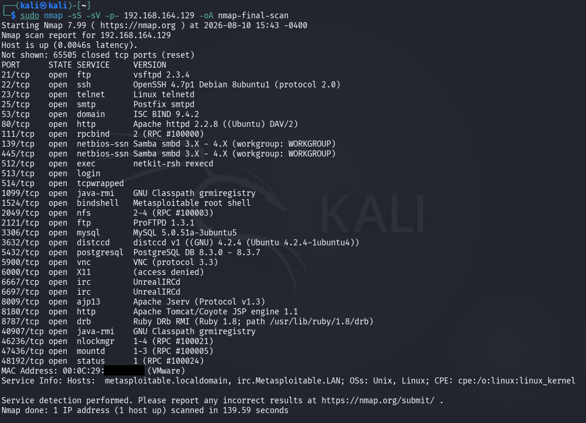

# Final Nmap Scan Report

## Objective

To perform a comprehensive Nmap scan of the authorized Metasploitable laboratory target and consolidate the results obtained during host discovery, port scanning, service and version detection, OS detection, NSE enumeration, and firewall detection.

## Lab Environment

- Operating System: Kali Linux
- Target Environment: Local VMware laboratory network
- Target System: Metasploitable 2
- Target IP Address: `192.168.164.129`
- Tool: Nmap 7.99
- Assessment Type: Network Reconnaissance and Enumeration
- Environment: Authorized Local Laboratory

## Introduction

This final scan report consolidates the network reconnaissance and enumeration activities performed against the authorized Metasploitable laboratory target.

The assessment was performed in multiple phases:

1. Host Discovery
2. Port Scanning
3. Service and Version Detection
4. OS Detection
5. NSE Script Scanning
6. Firewall Detection
7. Final Comprehensive Scan

The purpose of the final scan was to combine TCP port discovery with service and version detection across the complete TCP port range.

## Final Scan Command

```bash
sudo nmap -sS -sV -p- 192.168.164.129 -oA nmap-final-scan
```

## Command Explanation

### `sudo`

Runs Nmap with elevated privileges.

### `nmap`

Nmap is a network discovery and security auditing tool used to identify hosts, ports, services, operating system characteristics, and other network information.

### `-sS`

Performs a TCP SYN scan.

The SYN scan sends TCP SYN probes to identify the state of TCP ports without normally completing the full TCP connection.

### `-sV`

Enables service and version detection.

Nmap sends additional probes to open ports and analyzes the responses to identify the service and software version where possible.

### `-p-`

Instructs Nmap to scan all TCP ports from 1 through 65535.

This provides complete TCP port coverage rather than scanning only the most common ports.

### `192.168.164.129`

The IP address of the authorized Metasploitable laboratory target.

### `-oA nmap-final-scan`

The `-oA` option saves the scan output in multiple Nmap-supported formats using the specified filename prefix.

The filename prefix used in this practical was:

`nmap-final-scan`

## Methodology

The assessment was performed in several stages.

### Phase 1 — Host Discovery

Nmap host discovery was performed against the local laboratory subnet.

Command used:

```bash
sudo nmap -sn 192.168.164.0/24
```

The scan identified five reachable hosts within the subnet.

The Kali Linux system was identified at:

`192.168.164.128`

The Metasploitable target was identified at:

`192.168.164.129`

### Phase 2 — Port Scanning

A TCP SYN scan was performed against the target.

Command used:

```bash
sudo nmap -sS -p- 192.168.164.129
```

The scan covered all TCP ports from 1 through 65535.

Multiple open TCP ports were identified.

### Phase 3 — Service and Version Detection

Nmap service and version detection was performed against selected open ports.

Command used:

```bash
sudo nmap -sV -p 21,22,23,25,53,80,111,139,445 192.168.164.129
```

The scan identified services and software versions including FTP, SSH, Telnet, SMTP, DNS, HTTP, RPCBind, and Samba.

A broader service detection scan was also performed to identify additional services.

### Phase 4 — OS Detection

Operating system detection was performed using:

```bash
sudo nmap -O 192.168.164.129
```

An additional scan using:

```bash
sudo nmap -O --osscan-guess 192.168.164.129
```

was performed to obtain additional OS fingerprint guesses.

The results strongly suggested a Linux-based operating system, although Nmap did not provide an exact OS match.

### Phase 5 — NSE Script Scanning

Nmap default NSE scripts were executed against selected services.

Command used:

```bash
sudo nmap -sC -sV -p 21,22,23,25,53,80,111,139,445 192.168.164.129
```

The scan identified additional information including anonymous FTP access, SSH host keys, SMTP information, HTTP information, RPC details, and SMB security information.

### Phase 6 — Firewall Detection

A TCP ACK scan was performed against selected ports.

Command used:

```bash
sudo nmap -sA -p 21,22,23,25,53,80,111,139,445 192.168.164.129
```

The tested ports were reported as `unfiltered`.

This indicates that Nmap did not classify the tested ports as filtered during this ACK scan.

The result does not independently prove that no firewall exists.

### Phase 7 — Final Comprehensive Scan

The final scan combined TCP SYN scanning and service/version detection across the complete TCP port range.

Command used:

```bash
sudo nmap -sS -sV -p- 192.168.164.129 -oA nmap-final-scan
```

## Final Scan Results

The target host was reported as up.

The final scan covered all TCP ports from 1 through 65535.

Nmap reported:

`65505 closed tcp ports (reset)`

Multiple TCP ports were identified as open.

## Discovered Open TCP Ports

| Port | State | Service | Version / Information |
|---:|:---:|---|---|
| 21/tcp | open | ftp | vsftpd 2.3.4 |
| 22/tcp | open | ssh | OpenSSH 4.7p1 Debian 8ubuntu1 |
| 23/tcp | open | telnet | Linux telnetd |
| 25/tcp | open | smtp | Postfix smtpd |
| 53/tcp | open | domain | ISC BIND 9.4.2 |
| 80/tcp | open | http | Apache httpd 2.2.8 |
| 111/tcp | open | rpcbind | RPC #100000 |
| 139/tcp | open | netbios-ssn | Samba smbd 3.X - 4.X |
| 445/tcp | open | netbios-ssn | Samba smbd 3.X - 4.X |
| 512/tcp | open | exec | netkit-rsh rexecd |
| 513/tcp | open | login | OpenBSD/Solaris rlogind |
| 514/tcp | open | shell | tcpwrapped |
| 1099/tcp | open | java-rmi | GNU Classpath grmiregistry |
| 1524/tcp | open | bindshell | Metasploitable root shell |
| 2049/tcp | open | nfs | NFS / RPC |
| 2121/tcp | open | ftp | ProFTPD 1.3.1 |
| 3306/tcp | open | mysql | MySQL 5.0.51a-3ubuntu5 |
| 3632/tcp | open | distccd | distccd v1 |
| 5432/tcp | open | postgresql | PostgreSQL 8.3.0 - 8.3.7 |
| 5900/tcp | open | vnc | VNC protocol 3.3 |
| 6000/tcp | open | X11 | Access denied |
| 6667/tcp | open | irc | UnrealIRCd |
| 6697/tcp | open | irc | UnrealIRCd |
| 8009/tcp | open | ajp13 | Apache JServ |
| 8180/tcp | open | http | Apache Tomcat/Coyote JSP engine 1.1 |
| 8787/tcp | open | drb | Ruby DRb RMI |
| 40907/tcp | open | java-rmi | GNU Classpath grmiregistry |
| 46236/tcp | open | nlockmgr | RPC #100021 |
| 47436/tcp | open | mountd | RPC #100005 |
| 48192/tcp | open | status | RPC #100024 |

## Major Observations

The final scan demonstrated that the target exposes a large number of network services.

The exposed services include:

- FTP
- SSH
- Telnet
- SMTP
- DNS
- HTTP
- RPC
- SMB
- NFS
- RSH-related services
- Java RMI
- MySQL
- PostgreSQL
- VNC
- X11
- IRC
- Apache JServ
- Apache Tomcat
- Ruby DRb
- RPC services

Several services were identified on non-standard ports.

The target therefore presents a broad network attack surface within the laboratory environment.

## Key Security-Relevant Observations

### Legacy Services

The target exposes several legacy services and protocols, including Telnet and older remote shell-related services.

These services should receive additional security review in a real assessment.

### Multiple Network Services

A large number of services were reachable from the scanning system.

Each exposed service represents a potential area for configuration review and authorized security testing.

### Database Services

The target exposes:

- MySQL on port 3306
- PostgreSQL on port 5432

Database services should be reviewed for authentication, access control, network exposure, and configuration security.

### File Sharing Services

The target exposes SMB and NFS-related services.

These services should be reviewed for authentication, authorization, share permissions, and unnecessary exposure.

### Remote Access Services

The target exposes several remote-access-related services including SSH, Telnet, VNC, and other legacy remote services.

These services should be reviewed for secure configuration and appropriate access restrictions.

## NSE Findings

The NSE scan provided additional information about several services.

Important observations included:

- Anonymous FTP login was allowed.
- SSH host keys were identified.
- SMTP service capabilities were enumerated.
- Older SSLv2 configurations were detected.
- HTTP service and page title were identified.
- RPC program information was enumerated.
- Samba service information was identified.
- SMB security information was exposed.
- SMB message signing was reported as disabled.
- Guest account information was exposed through SMB enumeration.

These observations should be treated as enumeration findings and should be validated before considering them security vulnerabilities.

## OS Detection Findings

Nmap OS detection generated a TCP/IP fingerprint for the target.

The results strongly suggested a Linux-based operating system.

Several Linux kernel versions appeared as possible fingerprint matches.

However, Nmap did not provide an exact operating system match.

Therefore, the OS result should be treated as a probable fingerprint-based identification rather than confirmed operating system information.

## Firewall Detection Findings

The TCP ACK scan classified all tested ports as:

`unfiltered`

This means that Nmap did not observe filtering that caused the tested ports to be classified as filtered during the scan.

This result should not be interpreted as definitive proof that no firewall exists.

## Overall Assessment Summary

| Assessment Phase | Result |
|---|---|
| Host Discovery | Five reachable hosts identified in the local subnet |
| Target Identification | Metasploitable identified at `192.168.164.129` |
| Port Scanning | Multiple open TCP ports identified |
| Service Detection | Multiple network services identified |
| Version Detection | Software versions identified for numerous services |
| OS Detection | Linux-based OS strongly suggested |
| NSE Scanning | Additional service and configuration information obtained |
| Firewall Detection | Tested ports classified as unfiltered |
| Final Scan | Complete TCP port range scanned with service/version detection |

## Security Assessment Perspective

The reconnaissance results provide a detailed view of the target's externally reachable network attack surface.

The information collected during this assessment can be used to prioritize subsequent authorized security testing.

The most important next steps in a real assessment would include:

- Service configuration review
- Authentication and authorization testing
- Vulnerability validation
- Patch and version assessment
- SMB/NFS permission review
- Web application security testing
- Database security review
- Remote-access security review

Open ports and detected versions alone do not establish that a system is vulnerable.

Each potential issue must be validated through appropriate authorized testing.

## Limitations

The results of this assessment are specific to the local VMware laboratory environment.

Nmap fingerprinting and service detection are based on network responses and may not always identify exact software or operating system information.

Network conditions, firewall rules, virtualization, packet filtering, and service configuration can affect scan results.

Therefore, the findings should be interpreted within the context of the laboratory environment.

## Final Result

The Nmap network reconnaissance exercise successfully identified the target host, exposed TCP ports, running services, software versions, probable operating system characteristics, NSE enumeration information, and packet-filtering behavior.

The final comprehensive scan covered the complete TCP port range from 1 through 65535 and provided a consolidated view of the target's network attack surface.

## Evidence

The following screenshot shows the final comprehensive Nmap scan and its results.



## Conclusion

The complete Nmap network scanning exercise successfully demonstrated the major phases of network reconnaissance and enumeration.

The assessment progressed from identifying reachable hosts to discovering open ports, enumerating services and versions, fingerprinting the operating system, executing NSE scripts, analyzing filtering behavior, and performing a final comprehensive scan.

The collected results demonstrate how Nmap can be used to build a detailed understanding of an authorized target's network exposure.

## Authorization

This entire assessment was performed against an authorized local VMware laboratory environment containing a Metasploitable target for educational and cybersecurity training purposes.

Network scanning, enumeration, and security testing should only be performed against systems for which explicit authorization has been obtained.
